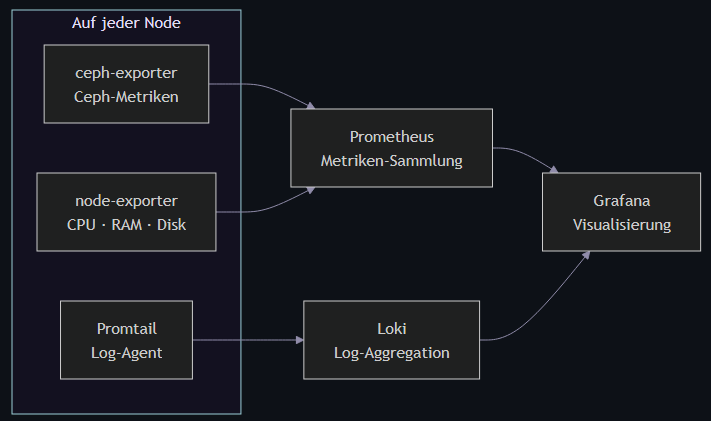

<!-- _class: lead invert -->

# Ceph Cluster on a Budget

### Verteilter Storage aus gebrauchter Hardware

---

## Motivation
 

- Speicher Bedarf wächst - kaufen oder selbst bauen?
  - RAM und Speicher sind teuer dieser Tage
- Ausfallsicherheit - wie redundant muss die Lösung sein?
- Alte Hardware liegt rum - warum wegwerfen?

 

> Ziel: Speicher Cluster zu möglichst geringen Kosten

---

## Was ist Ceph?

- Ceph verwaltet Speicher von verschiedenen Geräten in einem Cluster und stellt sie nach außen als einheitlichen Speicher bereit, während alle Hardwarekomponenten austauschbar bleiben.

 

- Unterstützt Block-, Datei- und Object-Storage gleichzeitig

- Orchestriert sich weitgehend selbst: 
  Rebalancing, Recovery und Replikation laufen automatisch im Hintergrund.

---

---

## Womit haben wir gebastelt?

- Alte Desktop-PCs und Server - zwischen 2007 - 2020 (13 Storage nodes)
  - Betriebssystem: Debian 13
- HDDs: 300 GB bis 7 TB bunt gemischt
- 2 × SSD (300 GB)
- Switch
- 3 Hetzner Cloud Nodes

 

> Aus allem zusammen gepuzzelt was das Lager noch zu bieten hatte.

---

## Specs

| Hardware | Detail | Jahr |
| --- | --- | ---: |
| ceph-tower10 | Intel Core i7-970 (Gulftown) | **2010** |
| Ceph-Tower4/5 | Intel Core i5-3570 (Ivy Bridge) | **2012** |
| CephTower2 | Intel Core i7-4770 (Haswell) | **2013** |
| tower-storage | Intel Core i5-6600 (Skylake) | **2015** |
| ceph-tower7 | Intel Xeon E-2236 (Coffee Lake) | **2018** |
| ceph-tower8 | Intel Xeon E-2288G (Coffee Lake) | **2020** |

---

## Kurioseste Funde aus den Benchmarks

Älteste Festplatte: Hitachi HDP725050GLA360 (~2008)
- 50.239 Betriebsstunden aktiv als OSD

ceph-tower5 bootet heute noch von einer Samsung HD250HJ, Baujahr ~2007

 

> Solange wie Hardware noch funktioniert kann Ceph sie nutzen.

---

## Ceph-Setup

| Komponente | Anzahl | Standort |
| --- | ---: | --- |
| Manager | 3 | Hetzner Cloud |
| Monitor | 5 | Hetzner Cloud |
| Storage Nodes | 13 | Lokales Datacenter
| OSDs | 37 | Lokales Datacenter |
| OSD Hosts | 13 | Lokales Datacenter |

**Heterogene OSD-Verteilung:**
- 2 bis 6 OSDs pro Node

---

## Hetzner Cloud - Warum?

| Node | Rolle |
| --- | --- |
| `CephMaster` | Manager · Monitor · WireGuard · statische IP |
| `CephClient1` | Manager · Monitor · Failover · statische IP |
| `CephClient2` | Manager · Monitor · Failover · statische IP |

- Statische öffentliche IP für VPN
- Manager & Monitors laufen unabhängig vom Lokalen-Stromnetz
- CephClient1/2: Failover für Manager/Monitor, **kein VPN-Takeover**

---

## Netzwerk: Das Problem

Lokale Internetanbindung auf **500 Mbit/s**

Ceph-interner Traffic belastet die Leitung:

- OSD-Replikation
- Rebalancing
- Recovery & Backfill

 

❌ Alles über WireGuard => Leitung sofort überlastet

---

## Netzwerk: Die Lösung - 2 getrennte Netze

| | **Netz 1 · WireGuard VPN** | **Netz 2 · Backbone** |
| --- | --- | --- |
| **Verbindet** | Hetzner Cloud <-> Datacenter | Storage-Nodes untereinander |
| **Traffic** | Client-Zugriff, Admin | Replikation, Rebalancing, Recovery |
| **Bandbreite** | 500 Mbit/s (ISP-Limit) | lokaler Switch - 1Gbit/s |
| **Statische IPs** | WireGuard-IPs | lokale IPs, kein DHCP |

 

- Ceph-interner Traffic läuft **nicht** über WireGuard
- die ISP-Leitung bleibt frei für externen Zugriff

---

## Monitoring Stack

Node-exporter
Ceph-exporter
Promtail
Loki
Prometheus
Grafana

---

<!-- _footer: '' -->

## Dashboard - Cluster im Idle

**Cluster-Zustand:**
- 89.1 TB Kapazität
- Write: 40.7 kB/s
- Latenz: ~8 ms

---

<!-- _footer: '' -->

## Dashboard - Host Ressourcen

**Im Idle:**
Ø CPU: 7.45 %
Ø RAM: 30.2 %
Ø Disk Load: 5.14 %

> Periodische CPU-Peaks durch Ceph-Hintergrundtasks

---

## Learnings

✅ Ceph läuft auf **heterogener Hardware** - kein Blocker

✅ **Netzwerktrennung ist der kritische Architekturpunkt**

✅ Cloud-Nodes als stabile externe Einstiegspunkte - günstig & effektiv

✅ Statische IPs vereinfachen Debugging erheblich

⚠️ Alte Hardware = unvorhersehbare Performance-Unterschiede

⚠️ Monitoring **von Anfang an** einrichten - nicht nachträglich

---

## Ausblick

- Dedizierte BlueStore SSDs
- Failover-Tests
- CRUSH Map verbesserung
- 10Gbit/s upgrade für lokales Netz
- Migration der Hetzner Cloud Nodes in das Datacenter

 

# Fragen?

`github.com/PhilippTheServer`
