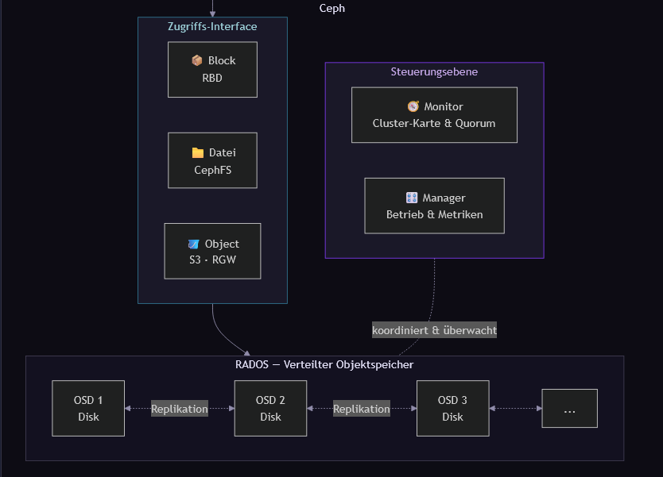
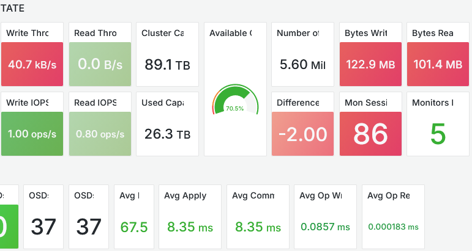
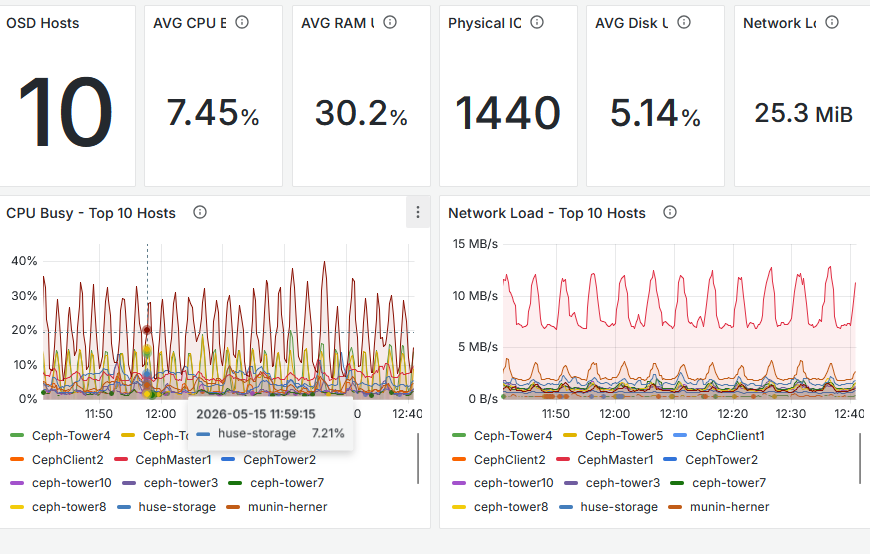

<!-- _class: lead invert -->

# Ceph Cluster on a Budget

### Verteilter Storage aus gebrauchter Hardware

---

## Motivation
 

- Speicher Bedarf wächst — kaufen oder selbst bauen?
  - RAM und Speicher sind teuer dieser Tage
- Ausfallsicherheit - wie redundant muss die Lösung sein?
- Alte Hardware liegt rum — warum wegwerfen?

 

> Ziel: Speicher Cluster zu möglichst geringen Kosten

---

## Was ist Ceph?

- Ceph verwaltet Speicher von verschiedenen Geräten in einem Cluster und stellt sie nach außen als einheitlichen Speicher bereit, während alle Hardwarekomponenten austauschbar bleiben.

 

- Unterstützt Block-, Datei- und Object-Storage gleichzeitig

- Orchestriert sich weitgehend selbst: 
  Rebalancing, Recovery und Replikation laufen automatisch im Hintergrund.

---

---

## Womit haben wir gebastelt?

- Alte Desktop-PCs und Server - zwischen 2007 - 2020
  - (noch mit DDR2 RAM)
  - Betriebssystem: Debian 13
- HDDs: 300 GB bis 7 TB bunt gemischt
- 2 × SSD (300 GB)
- Switch

 

> Aus allem zusammen gepuzzelt was das Lager noch zu bieten hatte.

---

## Die Zahlen

| Metrik              | Wert            |
| ------------------- | --------------: |
| Physische Nodes     | 13              |
| OSDs                | 37              |
| Cluster-Kapazität   | 89.1 TB         |
| Genutzte Kapazität  | 26.3 TB (29 %)  |
| HDD-Größen          | 300 GB – 7 TB   |
| Betriebssystem      | Debian 13       |

---

## 13 Jahre Hardware — ein Cluster

  

| Node | CPU | Jahr |
|---|---|---|
| ceph-tower10 | i7-970 (Gulftown) | **2010** |
| Ceph-Tower4/5 | i5-3570 (Ivy Bridge) | **2012** |
| CephTower2 | i7-4770 (Haswell) | **2013** |
| tower-storage | i5-6600 (Skylake) | **2015** |
| ceph-tower7 | Xeon E-2236 | **2018** |
| ceph-tower8 | Xeon E-2288G | **2020** |

  

  

**Kurioseste Funde:**

🦕 Älteste Platte: Hitachi 500 GB (~2008)
mit **50.239 Betriebsstunden** — noch aktiv

🖥️ ceph-tower8: brandneuer Xeon E-2288G,
betreibt aber eine **WD Green von 2009** als OSD

💾 ceph-tower5 bootet heute noch von einer
**Samsung HD250HJ — Baujahr ~2007**

  

> Ceph interessiert sich nicht für das Alter der Hardware — solange die Disk antwortet, wird sie genutzt.

---

## Architektur: Zwei Teile — ein Cluster

  

    
☁️ Hetzner Cloud

    

      Ceph Manager 
      Ceph Monitor (×5) 
      WireGuard-Server 
      Statische öffentliche IPs
    

  

  

    
🏠 Lokaler Keller

    

      13 physische Nodes 
      37 Ceph OSDs 
      Backbone-Switch 
      Statische lokale IPs
    

  

---

## Hetzner Cloud — Warum?

| Node | Rolle |
| --- | --- |
| `CephMaster` | Manager · Monitor · WireGuard · statische IP |
| `CephClient1` | Manager · Monitor · statische IP · Failover |
| `CephClient2` | Manager · Monitor · statische IP · Failover |

- Statische öffentliche IP — ohne eigenen Anschluss zu exponieren
- Manager & Monitors laufen unabhängig vom Keller-Stromnetz
- CephClient1/2: Failover für Manager/Monitor, **kein VPN-Takeover**

---

## Netzwerk: Das Problem

Lokale Internetanbindung: **500 Mbit/s**

Ceph-interner Traffic belastet die Leitung:

- OSD-Replikation
- Rebalancing
- Recovery & Backfill

 

❌ Alles über WireGuard = Leitung sofort gesättigt

---

## Netzwerk: Die Lösung

  

    <strong>☁️ Hetzner Cloud</strong> &nbsp;·&nbsp; CephMaster · CephClient1 · CephClient2
  

  

    ↕&nbsp; <em>WireGuard VPN — externer Client-Traffic (500 Mbit/s ISP-Leitung)</em>
  

  

    <strong>🏠 Lokaler Keller</strong> &nbsp;·&nbsp; 13 Nodes · 37 OSDs
    

      ↕&nbsp; <em>Backbone-Switch — Ceph-interner Storage-Traffic</em>
    

    
statische IPs · kein DHCP

  

---

## Ceph-Setup

| Komponente | Anzahl | Standort |
| --- | ---: | --- |
| Manager | 3 | Hetzner Cloud |
| Monitor | 5 | Hetzner Cloud |
| OSDs | 37 | Lokaler Keller |
| OSD Hosts | 13 | Lokaler Keller |

**Heterogene OSD-Verteilung:**
- 2 bis 6 OSDs pro Node
- Festplatten: 300 GB bis 7 TB — bewusst gemischt

---

## Monitoring-Stack

| Tool | Aufgabe |
| --- | --- |
| `ceph-exporter` | Ceph-Cluster-Metriken |
| `node-exporter` | CPU · RAM · Disk · Network |
| Prometheus | Metriken-Sammlung |
| Promtail + Loki | Log-Aggregation |
| Grafana | Visualisierung |
| Alertmanager | ⚠️ Installiert — noch nicht konfiguriert |

---

<!-- _footer: '' -->

## Dashboard — Cluster im Idle

**Cluster-Zustand:**
- 89.1 TB Kapazität
- Write: 40.7 kB/s
- 5 Monitors aktiv
- 37 OSDs online
- Latenz: ~8 ms

---

<!-- _footer: '' -->

## Dashboard — Host-Ressourcen

**Im Idle:**
- Ø CPU: 7.45 %
- Ø RAM: 30.2 %
- Ø Disk Load: 5.14 %
- 1440 physische Cores
- Periodische CPU-Peaks durch Ceph-Hintergrundprozesse

---

## Learnings

✅ Ceph läuft auf **heterogener Hardware** — kein Blocker

✅ **Netzwerktrennung ist der kritische Architekturpunkt**

✅ Cloud-Nodes als stabile externe Einstiegspunkte — günstig & effektiv

✅ Statische IPs vereinfachen Debugging erheblich

⚠️ Alte Hardware = unvorhersehbare Performance-Unterschiede

⚠️ Monitoring **von Anfang an** einrichten — nicht nachträglich

---

<!-- _class: lead invert -->

## Ausblick

Alertmanager konfigurieren · Dedizierte BlueStore-Devices
Automatisiertes Provisioning (Cephadm / Ansible)
Failover-Tests · Kapazitätsplanung

 

# Danke! Fragen?

`github.com/PhilippTheSurfer`
